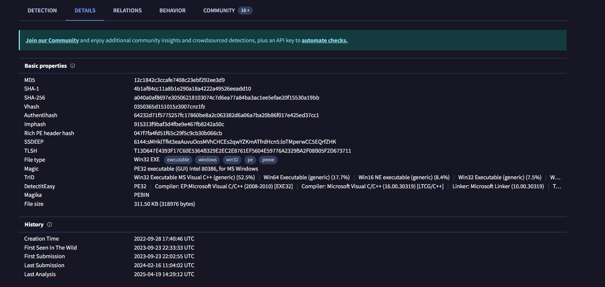
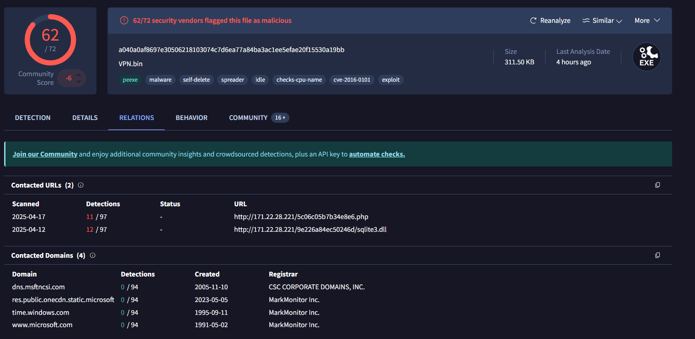
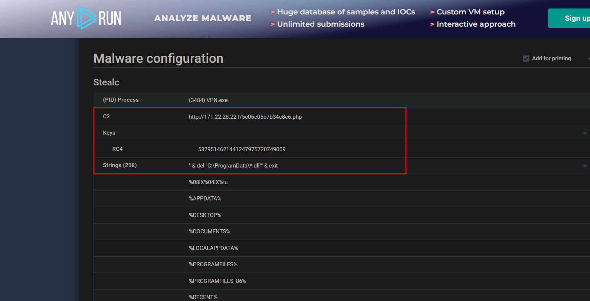
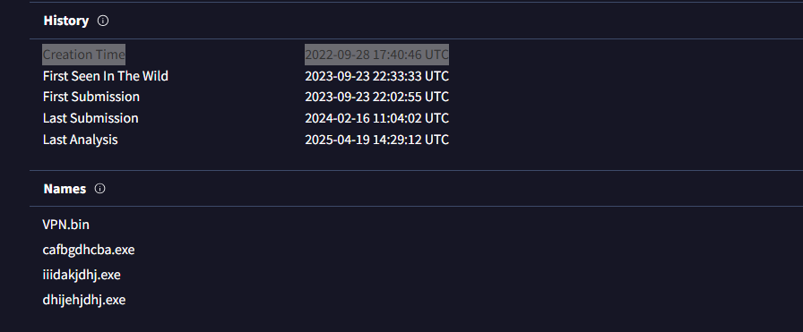
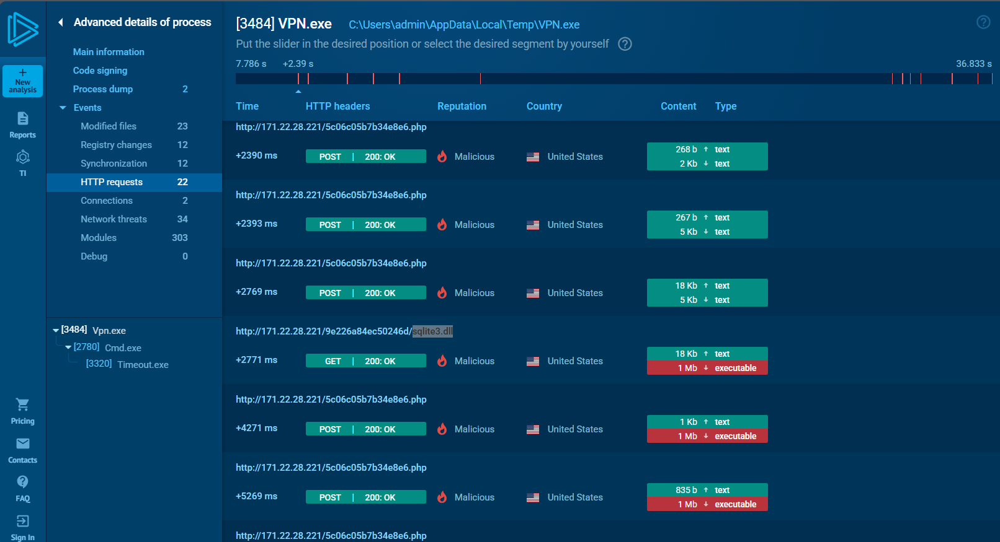
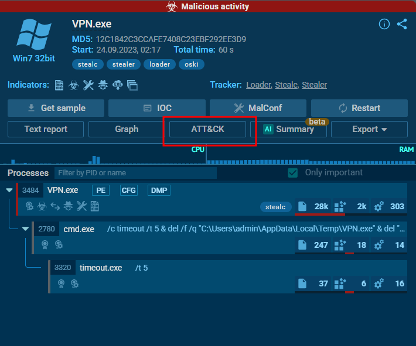
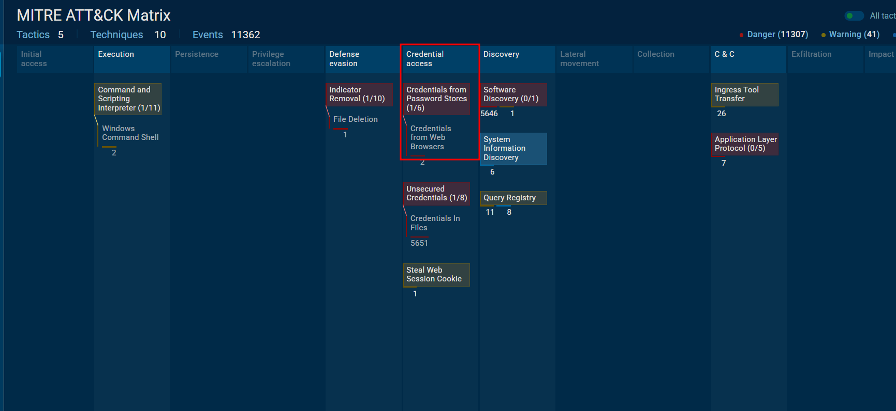
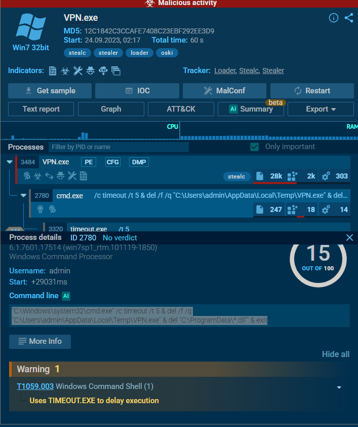

This is a writeup based on Oski Lab on Cyber Defenders which can be found here [Oski](https://cyberdefenders.org/blueteam-ctf-challenges/oski/)
## Scenario
The accountant at the company received an email titled "Urgent New Order" from a client late in the afternoon. 
When he attempted to access the attached invoice, he discovered it contained false order information. 
Subsequently, the SIEM solution generated an alert regarding downloading a potentially malicious file. 
Upon initial investigation, it was found that the PPT file might be responsible for this download. 
Could you please conduct a detailed examination of this file?

We are provided with a hash file ```12c1842c3ccafe7408c23ebf292ee3d91```
First check the hash on virus total

We observe the file is Malicious with the name "vpn.bin" with a community score of 62.

We can check other tabs in VirusTotal to get more info about the file.

In Details tab: we can observe the history of the file and other details


In relations tab we get to see some of the contacted domains and IPs the file communicates to:


In community tab, I got to find any run had already analyzed the file, so this would be easier for us to answer the questions:


In any run report: In malware configuration, we see some interesting data and strings:


We see any run already suggested the C2 and also RC4 key, and some strings run which does some sort of deletion on programdata.

## Questions.
1. Determining the creation time of the malware can provide insights into its origin. What was the time of malware creation?
```ANS: 2022-09-28 17:40```
This answer we already found in VT in details tab


2. Identifying the command and control (C2) server that the malware communicates with can help trace back to the attacker. Which C2 server does the malware in the PPT file communicate with?
```ANS: http://171.22.28.221/5c06c05b7b34e8e6.php```

The C2 can be seen in any run report or VT analysis on relations tab.

3. Identifying the initial actions of the malware post-infection can provide insights into its primary objectives. What is the first library that the malware requests post-infection?
```ANS: sqlite3.dll```
In the full analysis we can see the first dll downloaded as shown below.


4. Upon examining the malware, it appears to utilize the RC4 key for decrypting a base64 string. What specific RC4 key does this malware use?
```5329514621441247975720749009```

In any run report, we found the malware configuration section, where we saw the configuration files and strings involved in the malware.

5. Identifying an adversary's techniques can aid in understanding their methods and devising countermeasures. Which MITRE ATT&CK technique are they employing to steal a user's password?
```ANS: T1555```

AnyRun provides an easier way to find the Mitre Attack through its tab

Since the question asked about Mitre technique involved in stealing creds



6. Malware may delete files left behind by the actions of their intrusion activity. Which directory or path does the malware target for deletion?
```ANS: C:\ProgramData```

In any run, we see the malware opens cmd.exe and executes the command:


```bash
"C:\Windows\system32\cmd.exe" /c timeout /t 5 & del /f /q "C:\Users\admin\AppData\Local\Temp\VPN.exe" & del "C:\ProgramData\*.dll"" & exit
```
Basic explanation of the command is launches cmd.exe and waits 5 seconds and deletes vpn.exe (our file) located in Temp folder and deletes all .dll files in ProgramData and then exits the cmd shelll.

7. Understanding the malware's behavior post-data exfiltration can give insights into its evasion techniques. After successfully exfiltrating the user's data, how many seconds does it take for the malware to self-delete?
```ANS: 5```
The waiting of 5 seconds in the above command is the number it waits for self deletion

## Lessons Learnt
This was an engaging lab which through a single has we realized the importance of simple threat intel from VirusTotal to some further analysis on any run. The file is an info stealer which used a C2 for point of download itself and its related dll files. It also used RC4 encryption and after executing it opened cmd shell to self delete together with all .dll files.

## Comments




---