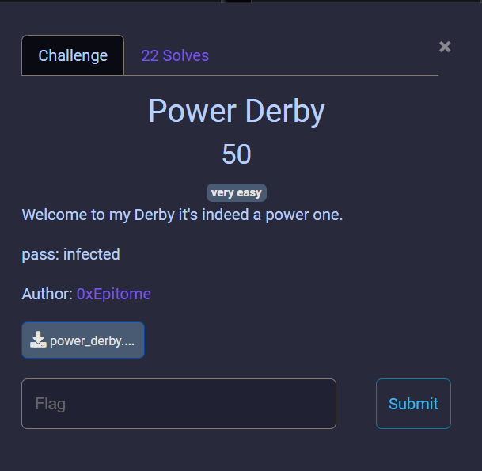

Here we are given a zip file with the password as `infected`, this was extracting a PS1 file


The best way to decode a powershell file is to let the script do the heavy lifting, in the code we see an iex (Invoke-Expression). The Invoke-Expression cmdlet returns the output of the expression or command after evaluating or running a given string as a command. A string entered at the command line is echoed or unaltered in the absence of invoke-expression. 
The script generally does the following:
- **Base64 Decoding**: It decodes a Base64-encoded string into binary data.
    
- **Decompression**: The binary data is decompressed using the Deflate compression algorithm.
    
- **Stream Reading**: The decompressed data is treated as a stream and read as text using ASCII encoding.

So we can remove the iex cmdlet and assign the rest of the string to a variable


Then we can just ran the variable, to see its contents:


This script is a simple script I copied from [github]( https://github.com/Whitecat18/Powershell-Scripts-for-Hackers-and-Pentesters) that outputs the system information of a machine, apart from the script we see random comments, which are what seem like base64 code, compile them and decode them to see what they are:
 Cyberchef is way does it way easier
 

The decoded base64:
```powershell
( $SHELLiD[1]+$sHELLID[13]+'X')( ( [cHAR[]] (87, 91,24,94 , 65,89 , 92,115, 38 , 88 , 28 ,28 ,115, 105 , 24 , 95, 85, 115, 38 , 29 , 74,115, 85 ,28, 89 , 115 , 109, 95,71,115 , 38,65 , 31, 115,20 ,78 ,25, 79 , 26, 24, 25 , 30,78 , 27 , 31,24 ,20,78, 21,25,79,73, 72 ,73 , 25, 28,24, 77,74 ,74, 24 , 20 ,28 , 29, 74,21, 81) 
| FoREacH-oBjECt { [cHAR]($_ -BxoR "0x2C" ) } ) -JOin'' )
```

The general purpose of this code, it is performing bitwise xor with the value 0x2c and after applying the bxor the result is converted to a string using [CHAR].  `$SHELLID` is a predefined PowerShell variable that contains the name of the current shell host, such as `ConsoleHost`

Now to decode back to cyberchef we can copy these values in hex and since we know the key perform the operation, we can have a script in powershell that does the work:
```powershell
$encoded = @(87, 91, 24, 94, 65, 89, 92, 115, 38, 88, 28, 28, 115, 105, 24, 95, 85, 115, 38, 29, 74, 115, 85, 28, 89, 115, 109, 95, 71, 115, 38, 65, 31, 115, 20, 78, 25, 79, 26, 24, 25, 30, 78, 27, 31, 24, 20, 78, 21, 25, 79, 73, 72, 73, 25, 28, 24, 77, 74, 74, 24, 20, 28, 29, 74, 21, 81)

$key = 0x2C

$decodedCharacters = $encoded | ForEach-Object { [char]($_ -bxor $key) }

$decodedString = -join $decodedCharacters

Write-Host "Flag: $decodedString"

```

the '@' allows us to pass multiple parameters to a variable, running it gives us the flag.
`{w4rmup_t00_E4sy_1f_y0u_Ask_m3_8b5c6452b7348b95cede504aff4801f9}`


## Comments

