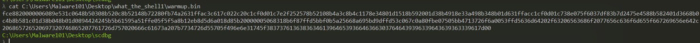

 This was an easy shellcode challenge which you were provided a .bin file.
 Shellcode is well explained in this [blog](https://medium.com/@avaen/extraction-and-analysis-of-injected-shellcode-77445e8b6504)
 
 

`NOTE: Although the files provided for the malware challenges were not harmful, it's always advisable to investigate malware in a controlled environment' `

In my case I am using [Flare VM](https://github.com/mandiant/flare-vm) which comes pre installed with many tools for malware analysis

I recently noted that you can decode shellcode by using python but it's not that clean. So the intended way was to use shellcode tools eg scdbg(shellcode debug) to debug the shellcode. There are many tools that can do it, but scdbg works best for me.

We can clean this shellcode so that we remain with the shellcode only as follows:

I am using Flare Vm for this, in scdbg we need 2 options that is /f which is for the path of the bin file and /s -1 which is for steps until the tool completes.

`scdbg.exe /f C:\Users\Malware101\Desktop\what_the_shell1\warmup.bin -s -1`

The shellcode does execute a cmd prompt which echoes the flag.

`flag: {w4rmUp_Inn1t_877a6864a9de96dcf07dd99c9d69639a}'`

## Comments

